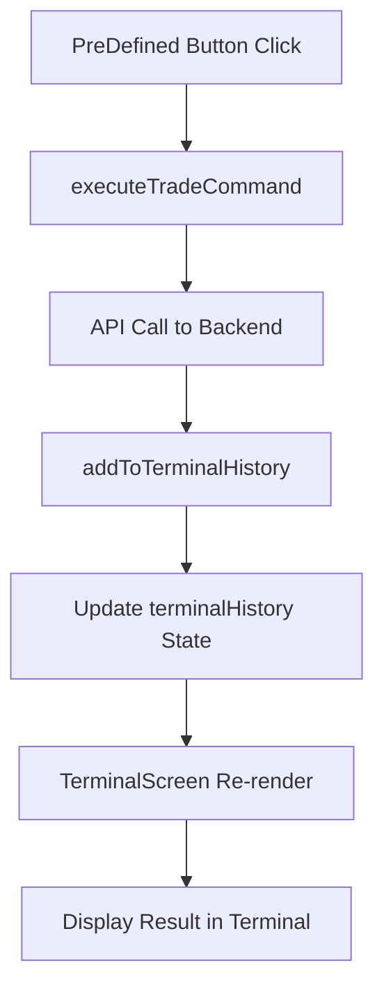

# Context API Implementation - TradeHub Frontend

## 📋 Genel Bakış

Bu dokümantasyon, TradeHub frontend uygulamasında **Context API** kullanarak component'lar arası iletişim kurma implementasyonunu açıklar.

## 🎯 Problem

İki farklı component arasında iletişim kurma ihtiyacı:
- **PreDefined.jsx**: Trade butonları içeren component
- **TerminalScreen.jsx**: Terminal arayüzü component'ı

**İhtiyaç**: PreDefined component'ındaki butonlara tıklandığında, TerminalScreen component'ında işlem sonuçlarının görüntülenmesi.

## 🏗️ Çözüm: Context API Yaklaşımı

### Neden Context API?

1. **Temiz Kod Yapısı**: API çağrıları tek bir yerde toplanmış
2. **Loose Coupling**: Component'lar birbirini doğrudan bilmiyor
3. **Maintainable**: Gelecekte yeni component'lar eklendiğinde kolayca genişletilebilir
4. **State Management**: Terminal history'si merkezi olarak yönetiliyor
5. **Reusable**: Context'i başka component'larda da kullanabilirsiniz

## 📁 Dosya Yapısı

```
src/
├── context/
│   └── TradeContext.jsx          # Merkezi state yönetimi
├── components/
│   ├── PreDefined.jsx            # Trade butonları
│   └── terminal/
│       └── TerminalScreen.jsx    # Terminal arayüzü
└── App.jsx                       # Context provider wrapper
```

## 🔧 Implementation Detayları

### 1. TradeContext.jsx

```javascript
import React, { createContext, useContext, useState } from 'react';

const TradeContext = createContext();

export const useTradeContext = () => {
  const context = useContext(TradeContext);
  if (!context) {
    throw new Error('useTradeContext must be used within a TradeProvider');
  }
  return context;
};

export const TradeProvider = ({ children }) => {
  const [terminalHistory, setTerminalHistory] = useState([
    {
      input: "Welcome to TradeHub",
      output: ["Type help for available commands"],
    },
  ]);

  const addToTerminalHistory = (input, output) => {
    setTerminalHistory(prev => [...prev, { input, output }]);
  };

  const clearTerminalHistory = () => {
    setTerminalHistory([]);
  };

  const executeTradeCommand = async (currency, leverage, flag) => {
    // Backend formatına uygun: long için pozitif, short için negatif değer
    const leverageValue = flag === "short" ? -parseInt(leverage) : parseInt(leverage);
    const command = `${currency} ${leverageValue}`;
    const input = `${currency} ${leverageValue}`;
    
    try {
      const response = await fetch("http://localhost:5000/command", {
        method: "POST",
        headers: {
          "Content-Type": "application/json",
        },
        body: JSON.stringify({ 
          symbol: currency, 
          leverage: leverageValue 
        }),
      });
      
      if (response.ok) {
        const result = await response.json();
        const positionType = flag === "short" ? "Short" : "Long";
        addToTerminalHistory(input, `${positionType} position opened: ${currency.toUpperCase()} ${Math.abs(leverageValue)}x - ${result.message || 'Success'}`);
      } else {
        const errorData = await response.json().catch(() => ({}));
        addToTerminalHistory(input, `Error: Failed to open ${flag} position - ${errorData.error || 'Unknown error'}`);
      }
    } catch (error) {
      addToTerminalHistory(input, `Error: ${error.message}`);
    }
  };

  const value = {
    terminalHistory,
    addToTerminalHistory,
    clearTerminalHistory,
    executeTradeCommand,
  };

  return (
    <TradeContext.Provider value={value}>
      {children}
    </TradeContext.Provider>
  );
};
```

### 2. App.jsx - Context Provider Wrapper

```javascript
import { TradeProvider } from "./context/TradeContext";

function App() {
  return (
    <TradeProvider>
      {/* Tüm component'lar burada */}
    </TradeProvider>
  );
}
```

### 3. PreDefined.jsx - Context Kullanımı

```javascript
import { useTradeContext } from "../context/TradeContext";

function PreDefined() {
  const { executeTradeCommand } = useTradeContext();
  
  const handleClick = async (currency, leverage, flag) => {
    // Context üzerinden trade command'ı çalıştır
    await executeTradeCommand(currency, leverage, flag);
  };

  // Component render logic...
}
```

### 4. TerminalScreen.jsx - Shared History Kullanımı

```javascript
import { useTradeContext } from "../../context/TradeContext";

const TerminalScreen = () => {
  const { terminalHistory, addToTerminalHistory, clearTerminalHistory } = useTradeContext();
  
  // Terminal logic using shared history...
};
```

## 🔄 Veri Akışı



## 📊 Backend Integration

### API Format

**Long İşlem:**
- Frontend: `executeTradeCommand("btc", "10", "long")`
- Backend'e gönderilen: `{ symbol: "btc", leverage: 10 }`
- Terminal'de görünen: `btc 10`

**Short İşlem:**
- Frontend: `executeTradeCommand("btc", "10", "short")`
- Backend'e gönderilen: `{ symbol: "btc", leverage: -10 }`
- Terminal'de görünen: `btc -10`

### Endpoint
```
POST http://localhost:5000/command
Content-Type: application/json

{
  "symbol": "btc",
  "leverage": 10  // veya -10
}
```

## 🎨 Context API Avantajları

### ✅ Avantajlar

1. **Merkezi State Yönetimi**: Tüm trade işlemleri tek yerden yönetiliyor
2. **Component Decoupling**: Component'lar birbirini doğrudan bilmiyor
3. **Scalable**: Yeni component'lar kolayca eklenebilir
4. **Maintainable**: Kod daha temiz ve organize
5. **Reusable**: Context başka yerlerde de kullanılabilir

### ❌ Alternatif Yaklaşımlar ve Dezavantajları

1. **Props Drilling**: Çok fazla prop geçişi gerektirir
2. **Event Bus**: Karmaşık ve debug zor
3. **Global State**: Over-engineering olabilir

## 🚀 Kullanım Örnekleri

### Yeni Component Ekleme

```javascript
import { useTradeContext } from "../context/TradeContext";

function NewComponent() {
  const { executeTradeCommand, terminalHistory } = useTradeContext();
  
  // Context'i kullan
}
```

### Terminal History'ye Manuel Ekleme

```javascript
const { addToTerminalHistory } = useTradeContext();

addToTerminalHistory("Manual Command", "Custom output");
```

## 🔧 Debug ve Troubleshooting

### Context Hook Hatası
```javascript
// Hata: useTradeContext must be used within a TradeProvider
// Çözüm: Component'ı TradeProvider ile sarmalayın
```

### State Güncelleme Sorunları
```javascript
// State güncellenmiyor mu?
// useEffect dependency array'ini kontrol edin
useEffect(() => {
  // logic
}, [terminalHistory]); // dependency ekleyin
```

## 📈 Gelecek Geliştirmeler

1. **Error Boundary**: Context için error handling
2. **Loading States**: API çağrıları için loading durumları
3. **Caching**: API sonuçlarını cache'leme
4. **WebSocket**: Real-time güncellemeler
5. **Persistence**: Terminal history'yi localStorage'da saklama

## 🎯 Sonuç

Context API yaklaşımı, component'lar arası iletişim için modern ve maintainable bir çözüm sunuyor. Bu implementasyon:

- ✅ Temiz ve organize kod yapısı
- ✅ Backend integration
- ✅ Scalable architecture
- ✅ React best practices

sağlıyor ve gelecekteki geliştirmeler için sağlam bir temel oluşturuyor. 